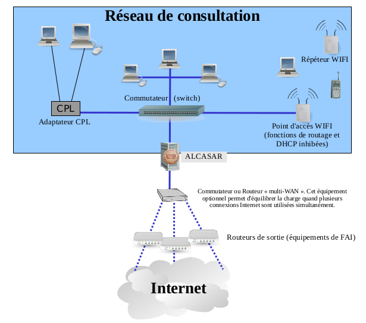
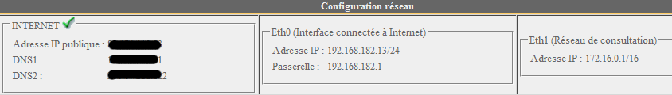
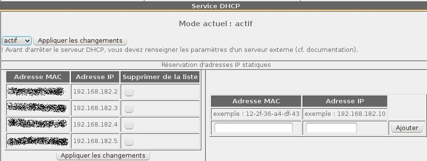

Les équipements de consultation peuvent être connectés sur le réseau de consultation au moyen de différentes technologies (filaire Ethernet, WiFi, CPL, etc.). Pour tous ces équipements, ALCASAR joue le rôle de serveur de noms de domaine (DNS), de serveur de temps (NTP) et de routeur par défaut (default gateway).

!!! danger "ATTENTION"
    Sur le réseau de consultation, il ne doit y avoir aucun autre routeur (vérifiez bien la configuration des points d'accès WIFI).

Le plan d'adressage IP du réseau de consultation est défini lors de l'installation du portail.

Exemple pour un réseau de consultation en classe C (proposé par défaut) :

- Adresse IP du réseau : 192.168.182.0/24 (masque de réseau : 255.255.255.0) ;
- Nombre maximum d'équipements : 253 ;
- Adresse IP de la carte eth1 d'ALCASAR : 192.168.182.1/24 ;
- Paramètres des équipements :

    - adresses IP disponibles : de 192.168.182.3 à 192.168.182.254 (statiques ou dynamiques) ;
    - adresses du serveur DNS : 192.168.182.1 (adresse IP d'ALCASAR) ;
    - suffixe DNS : localdomain (ce suffixe doit être renseigné pour les équipements en adressage statique) ;
    - adresse du routeur par défaut (default gateway) : 192.168.182.1 (adresse IP d'ALCASAR) ;
    - masque de réseau : 255.255.255.0

# Paramètres d'ALCASAR

Le menu « système » + « réseau » vous permet de visualiser les paramètres réseau d'ALCASAR.

### Configuration IP

Ces paramètres ne sont actuellement pas modifiables directement via l'interface graphique. Vous pouvez néanmoins les changer via le mode console en éditant le fichier `/usr/local/etc/alcasar.conf`. Une fois vos modifications effectuées, activez-les en lançant la commande `alcasar-conf.sh -apply`.

### Serveur DHCP

Le serveur DHCP (Dynamic Host Control Protocol) fournit de manière dynamique les paramètres réseau aux équipements de consultation. Vous pouvez réserver des adresses IP pour vos équipements exigeant un adressage fixe (ou statique) comme vos serveurs, vos imprimantes ou vos points d'accès WIFI (cf. §2.2.d).ALCASAR doit être le seul routeur et le serveur DHCP sur le réseau de consultation. Dans le cas contraire, assurez-vous de bien maîtriser l'architecture multi-serveur DHCP (cf. §8.6.a concernant la cohabitation avec un serveur A.D. ©).
