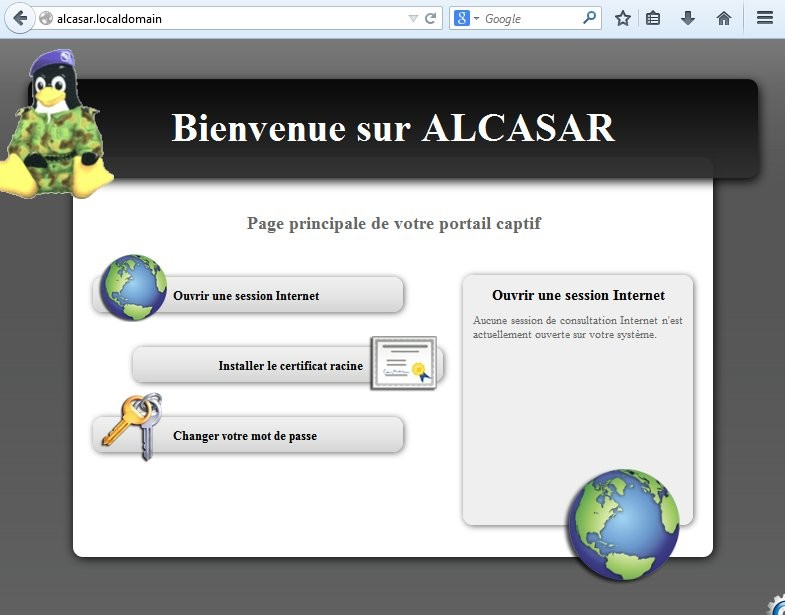
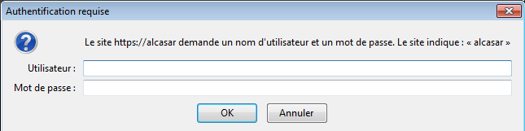
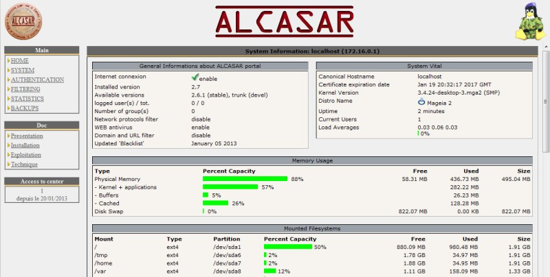

ALCASAR est un contrôleur d'accès au réseau (NAC : Network Access Controler) libre et gratuit. Ce document a pour objectif d'expliquer ses différentes possibilités d'exploitation et d'administration.

Concernant les utilisateurs du réseau de consultation, la page d'interception suivante est affichée dès que leur navigateur tente de joindre un site Internet en HTTP. Cette page est présentée en 6 langues (anglais, espagnol,allemand, hollandais, français et portugais) en fonction de la configuration de leur navigateur. Tans qu'ils n'ont pas satisfait au processus d'authentification, aucune trame réseau ne peut traverser ALCASAR.

La page d'accueil du portail est consultable à partir de n'importe quel équipement situé sur le réseau de consultation. Elle est située à l'URL [http://alcasar.fr](http://alcasar.fr) (ou [http://alcasar.localdomain](http://alcasar.localdomain)). Elle permet aux usagers de se connecter, de se déconnecter, de changer leur mot de passe et d'intégrer le certificat de sécurité dans leur navigateur.
Cette page permet aux administrateurs d'accéder au centre de gestion graphique « ACC » (ALCASAR Control Center) en cliquant sur la roue crantée située en bas à droite de la page (ou via le lien : [https://alcasar.localdomain/acc](https://alcasar.localdomain/acc)).

Ce centre de gestion est exploitable en deux langues (anglais et français) via une connexion chiffrées (HTTPS). Une authentification est requise au moyen d'un compte d'administration lié à l'un des trois profils suivants (cf.§7.1) :

- profil « admin » permettant d'accéder à toutes les fonctions d'administration du portail ;
- profil « manager » limité aux tâches de gestion des usagers du réseau de consultation ;
- profil « backup » limité aux tâches de sauvegarde et d'archivage des fichiers journaux.

!!! note "Note"
    Le détecteur d’intrusion intégré à ALCASAR interdira toute tentatives de nouvelle connexion pendant 3’, s’il a détecté 3 échecs consécutifs de connexion au centre de gestion.
