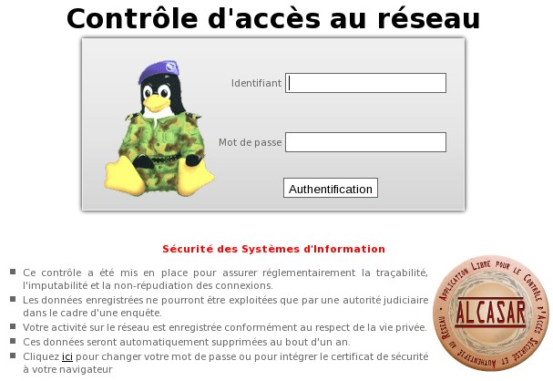

#Introduction

ALCASAR est un contrôleur d'accès au réseau (NAC : Network Access Controler) libre et gratuit. Ce document
a pour objectif d'expliquer ses différentes possibilités d'exploitation et d'administration.

Concernant les utilisateurs du réseau de consultation, la page d'interception suivante est affichée dès que leur
navigateur tente de joindre un site Internet en HTTP. Cette page est présentée en 6 langues (anglais, espagnol,
allemand, hollandais, français et portugais) en fonction de la configuration de leur navigateur. Tans qu'ils n'ont
pas satisfait au processus d'authentification, aucune trame réseau ne peut traverser ALCASAR.

